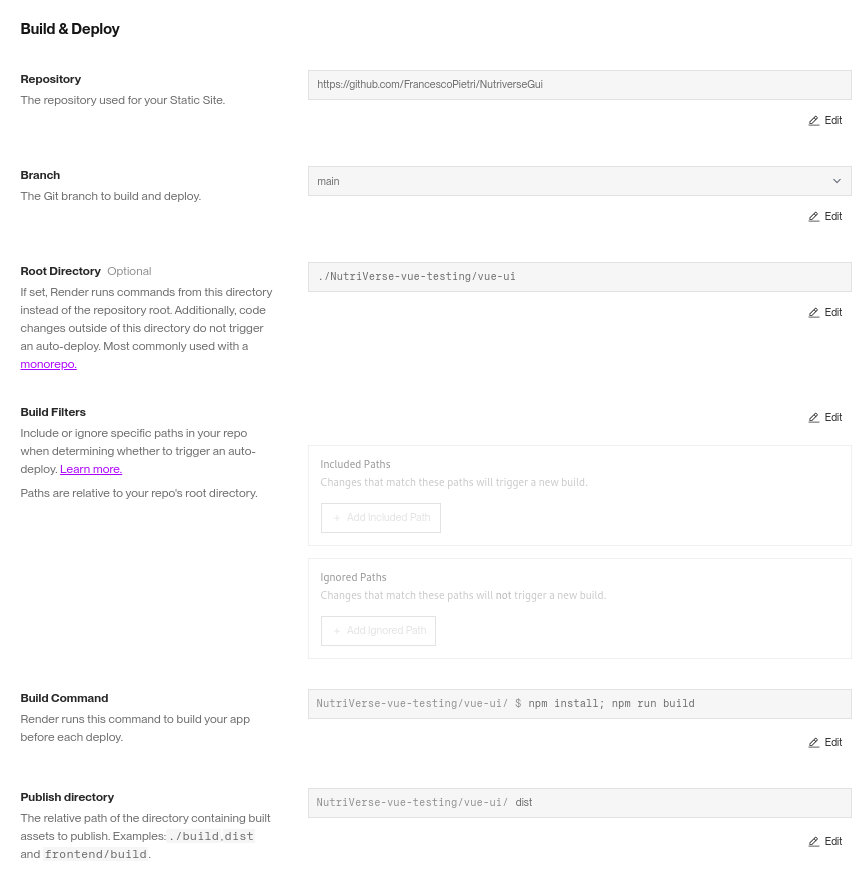

# Nutriverse Frontend Repository
*Developed for the Software Engineering course by Francesco Pietri, Patrick Cerka, Matteo Frigo.*

### ***For Future Development***

1. **Fork and Clone the Repository**  
   - Fork this repository.
   - Clone it using git in your favorite IDE.

2. **Install Node.js and Dependencies**  
   - Ensure you have [Node.js](https://nodejs.org/) installed.
   - Navigate to the project directory and install all necessary dependencies by running:
     ```sh
     npm install
     ```

3. **Run Vite's Development Environment**  
   - Start the development environment with:
     ```sh
     npm run dev
     ```

### ***For Deployment on Render***

1. **Create a New Service**  
   - Select **"Static Site"** when creating a new service on Render.

2. **Follow These Settings**  
     

The backend of the application is located in a separate repository: [NutriVerse Backend](https://github.com/0PkCk0/NutriVerse).
